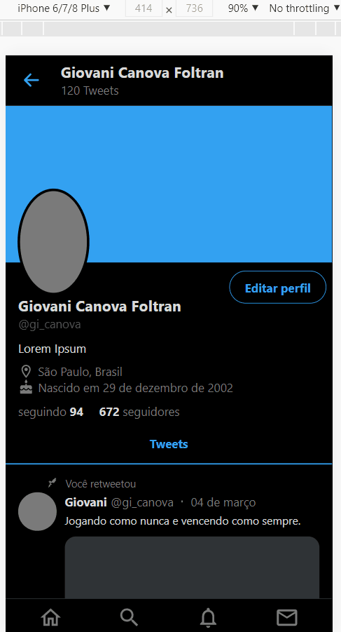
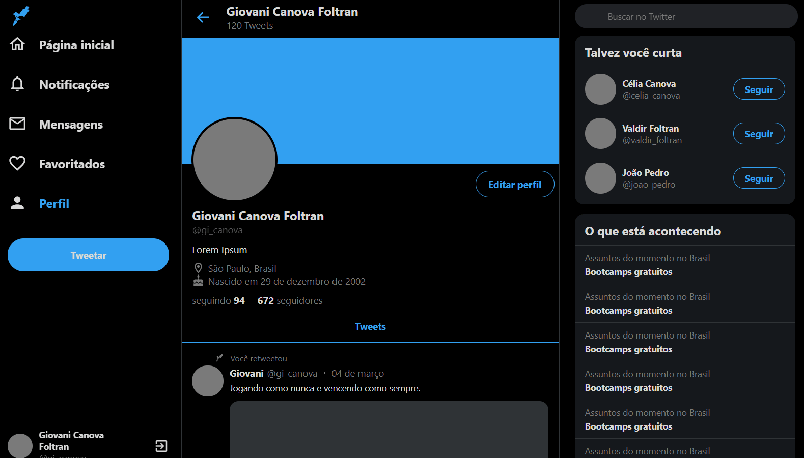

# Sobre:
Recriando uma interface responsiva do [Twitter](https://twitter.com/).
---
<br />
<br />
<h1>Scroll infinto no mobile:</h1>
<br />
<br />

<p align="center">
    
</p>

<br />
<br />
<h1>Scroll infinto em dispositivos maiores:</h1>
<br />
<br />

<h1>
    
</h1>

# Tecnologias:
- [ReactJS](https://pt-br.reactjs.org/)
- [Styled Components](https://styled-components.com/)
- [TypeScript](https://www.typescriptlang.org/)

---

# Como baixar:

```
    $ git clone https://github.com/Giovani2912/Interface-Twitter

    $ cd Interface-Twitter

# Caso esteja utilizando o npm

    $ npm install

    $ npm start

# Caso esteja utilizando o yarn

    $ yarn add

    $ yarn start

```